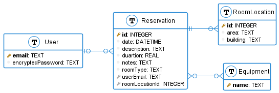

# RomResBot

This is a tool for setting up scheduled room reservations on the Norwegian University of Science and Technology's (NTNU) room reservation system [RomRes](https://tp.uio.no/ntnu/rombestilling/). RomRes disallows users to make reservations more than 2 weeks ahead. This application will store your reservation and automatically create the reseravation on NTNU's pages when it is within the 2 week interval.

## Storage

Reservations are stored within an SQLite database to retrieve from when the time to make the reservation comes. Note that when a user requests a scheduling, their password is stored **encrypted** in the database. **_No hashing_** is done to the password, since it would be impossible to enter the password into RomRes to complete the reservation that way. Therefore, users of this system should host this application themselves, or know and trust the provider of the service they are using.

